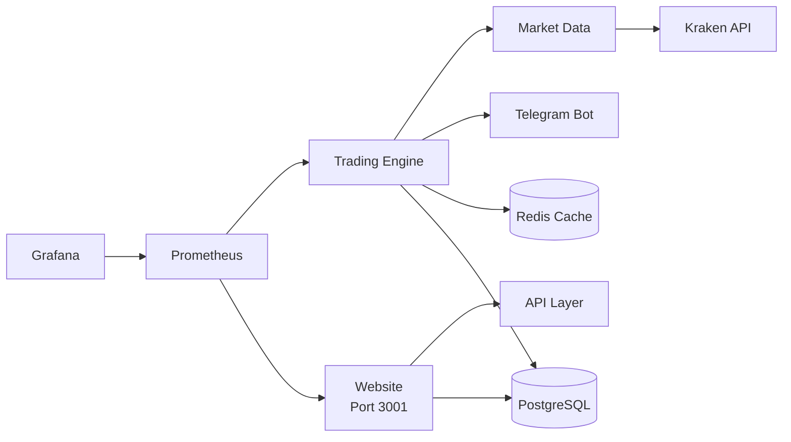

# SignalCartel Decoupled Service Architecture

## 🎯 Overview
We've transitioned from a monolithic startup script to a **decoupled, service-oriented architecture** where each component runs independently with its own lifecycle management.

## 🔄 Migration from Monolithic to Decoupled

### Previous Issues (Monolithic)
- **Single point of failure**: One service crash took down everything
- **Resource conflicts**: 6+ services competing for memory/CPU
- **Port conflicts**: Services fighting over ports 3001, 3100-3103
- **Unpredictable crashes**: System failing after ~98 minutes
- **Difficult debugging**: Hard to isolate which service was failing
- **No independent scaling**: Couldn't restart individual services

### New Architecture Benefits
- **Service isolation**: Each service runs independently
- **Independent lifecycle**: Start/stop/restart services individually
- **Resource management**: Each service has defined resource limits
- **Easy debugging**: Clear logs per service
- **Container-ready**: Prepared for Docker/Kubernetes deployment
- **Scalability**: Services can be scaled independently

## 📁 Service Structure

```
scripts/services/
├── start-website.sh      # Start Next.js website
├── stop-website.sh       # Stop website
├── start-trading.sh      # Start trading engine
├── stop-trading.sh       # Stop trading engine
└── status.sh            # Check all services status
```

## 🚀 Quick Start Commands

### Individual Service Control
```bash
# Start services independently
./scripts/services/start-website.sh
./scripts/services/start-trading.sh

# Stop services
./scripts/services/stop-website.sh
./scripts/services/stop-trading.sh

# Check status
./scripts/services/status.sh
```

### Decoupled Startup Script
```bash
# Minimal mode (recommended) - just website + trading
./scripts/start-server-decoupled.sh minimal

# Standard mode - adds separate market data collector
./scripts/start-server-decoupled.sh standard

# Full mode (not recommended) - all services
./scripts/start-server-decoupled.sh full
```

## 🐳 Docker Architecture

### Services Defined
1. **website** - Next.js frontend (port 3001)
2. **trading-engine** - Strategy execution with Telegram alerts
3. **market-data** - Dedicated market data collection
4. **redis** - Caching and pub/sub messaging
5. **postgres** - Production database (replaces SQLite)
6. **prometheus** - Metrics collection (optional)
7. **grafana** - Visualization (optional)

### Docker Commands
```bash
# Start all services
docker-compose up -d

# Start specific services
docker-compose up -d website trading-engine

# View logs
docker-compose logs -f trading-engine

# Stop services
docker-compose down

# With monitoring stack
docker-compose --profile monitoring up -d
```

## 📊 Service Communication



## 🔧 Service Management

### PID File Management
Each service maintains its own PID file:
- `/tmp/signalcartel-website.pid`
- `/tmp/signalcartel-trading.pid`

### Health Checks
- Website: `curl http://localhost:3001/api/health`
- Trading: Check process existence and log activity

### Resource Limits
- Trading Engine: `NODE_OPTIONS=--max-old-space-size=2048`
- Market Data: `NODE_OPTIONS=--max-old-space-size=1024`
- Website: Default Node.js memory

## 📝 Migration Guide

### From Old System
```bash
# Stop old monolithic system
./scripts/stop-server.sh

# Start with new decoupled approach
./scripts/start-server-decoupled.sh minimal
```

### To Docker
```bash
# Build images
docker-compose build

# Start services
docker-compose up -d

# Import existing data
docker cp prisma/dev.db signalcartel-postgres:/tmp/
docker exec signalcartel-postgres psql -U signalcartel -d signalcartel -f /tmp/import.sql
```

## 🚨 Troubleshooting

### Port Conflicts
```bash
# Check what's using a port
lsof -i :3001

# Kill process using port
kill $(lsof -t -i:3001)
```

### Service Won't Start
```bash
# Check for stale PID files
rm /tmp/signalcartel-*.pid

# Check logs
tail -f logs/website.log
tail -f strategy-execution-engine.log
```

### Memory Issues
```bash
# Monitor memory usage
free -m
ps aux | sort -rn -k 4 | head

# Restart with lower memory limits
NODE_OPTIONS=--max-old-space-size=512 npm run dev
```

## 🎯 Best Practices

1. **Use minimal mode** for development and testing
2. **Monitor logs** regularly for errors
3. **Set up log rotation** to prevent disk fill
4. **Use Docker** for production deployment
5. **Enable monitoring** stack for production
6. **Regular backups** of database and configuration

## 📈 Future Enhancements

- [ ] Kubernetes deployment manifests
- [ ] Auto-scaling based on load
- [ ] Circuit breakers for API calls
- [ ] Message queue (RabbitMQ/Kafka) for service communication
- [ ] Distributed tracing (Jaeger)
- [ ] Service mesh (Istio)

## 🔗 Related Documentation

- [SYSTEM_CHANGELOG.md](./SYSTEM_CHANGELOG.md) - System changes and fixes
- [docker-compose.yml](./docker-compose.yml) - Docker service definitions
- [README.md](./README.md) - Main project documentation